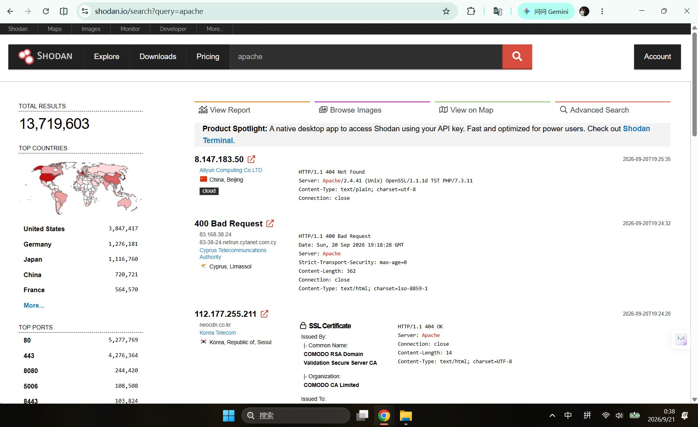
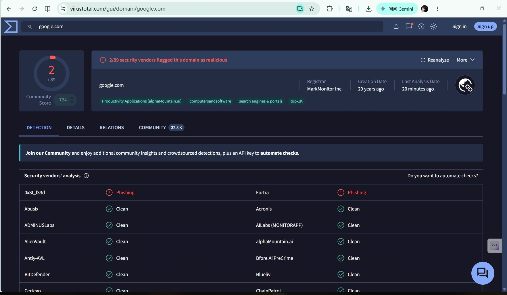
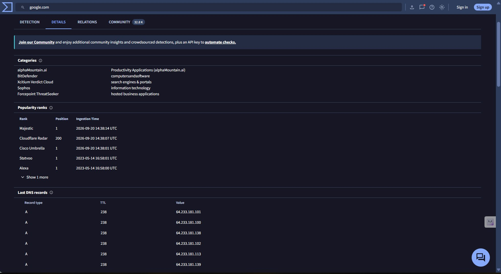
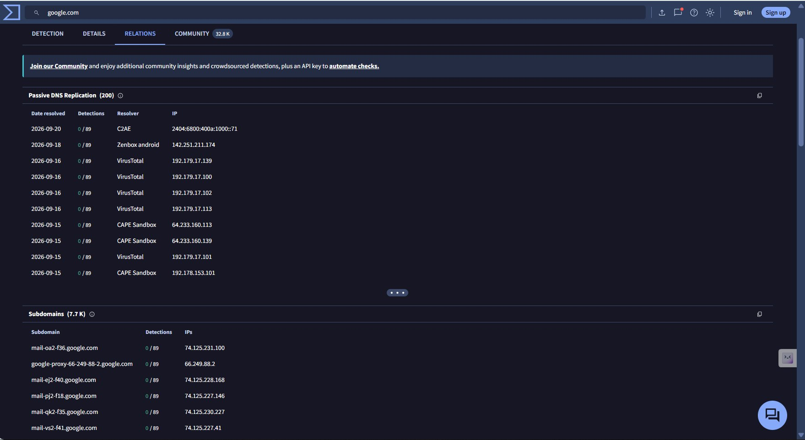
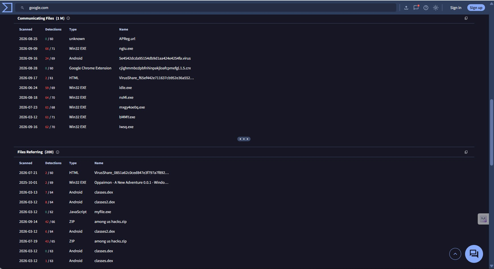

# Week 2 — Data Collection Process

## 1. Introduction

This week focuses on the data collection process for Cyber Threat Intelligence (CTI).

The main goal is to understand different types of threat intelligence data sources, distinguish between open-source and closed-source data, perform basic OSINT collection, and develop a data source mapping for the project.

This work extends the CTI foundation established in Week 1 and prepares the project for data processing and analysis.

The work is connected to the main project:

**MITRE ATT&CK-Based SIEM Threat Hunting and Detection**

---

## 2. Objectives

The objectives of Week 2 are:

- Understand the difference between open-source and closed-source data.
- Understand the role of OSINT in Cyber Threat Intelligence.
- Identify useful external and internal data sources.
- Perform basic OSINT data collection using Shodan, VirusTotal, and Maltego.
- Develop a data source mapping for threat analysis.
- Identify the types of information that can support SIEM-based threat hunting.
- Evaluate the usefulness and limitations of different data sources.

---

## 3. Open-Source vs. Closed-Source Data

Threat intelligence data can come from different types of sources.

### 3.1 Open-Source Data

Open-source data is information that is publicly available and can be collected from publicly accessible sources.

Examples include:

- Public websites
- Security research reports
- Public threat intelligence databases
- Public DNS information
- Search engines
- Security community publications
- Public vulnerability databases

Open-source intelligence (OSINT) can provide useful information for understanding infrastructure, indicators, vulnerabilities, and threat activity.

### 3.2 Closed-Source Data

Closed-source data is information that is not publicly available and is normally accessible only to authorized users or organizations.

Examples include:

- Internal SIEM logs
- Windows Event Logs
- Endpoint telemetry
- Firewall logs
- Authentication logs
- Internal network traffic
- Security alerts
- Incident response data

Closed-source data is particularly important for investigating activity inside an organization's own environment.

### 3.3 Comparison

| Characteristic | Open-Source Data | Closed-Source Data |
|---|---|---|
| Accessibility | Publicly accessible | Restricted |
| Examples | Shodan, VirusTotal, public reports | SIEM logs, firewall logs, endpoint logs |
| Main Use | External intelligence and enrichment | Internal monitoring and investigation |
| Ownership | Public or third-party sources | Organization or authorized provider |
| Privacy | Generally publicly available | May contain sensitive information |
| Project Relevance | Threat intelligence enrichment | Threat detection and investigation |

---

## 4. OSINT and Cyber Threat Intelligence

Open-Source Intelligence (OSINT) is the collection and analysis of information from publicly available sources.

In cybersecurity, OSINT can help analysts identify:

- IP addresses
- Domains
- URLs
- File hashes
- Exposed services
- Technologies
- Certificates
- Vulnerabilities
- Infrastructure relationships
- Public threat reports

OSINT can therefore provide additional context for indicators discovered during threat hunting.

The general process can be represented as:

    Public Information
            |
            v
          OSINT
            |
            v
      Data Collection
            |
            v
       Data Validation
            |
            v
    Threat Intelligence
            |
            v
    SIEM / Threat Hunting

---

## 5. Shodan

Shodan is a search engine that indexes information about Internet-connected devices and services.

For cybersecurity research, Shodan can provide information such as:

- IP addresses
- Open ports
- Network services
- Service banners
- Software information
- TLS/SSL certificate information
- Potentially exposed systems

### Project Relevance

Shodan can support reconnaissance and external infrastructure analysis.

For example, an analyst can investigate publicly exposed services associated with a domain or IP address and use the collected information as additional context during threat analysis.

### Data Collected

| Data Type | Example Use |
|---|---|
| IP Address | Identify exposed infrastructure |
| Open Port | Identify accessible services |
| Service | Understand exposed network services |
| Banner | Identify service or software information |
| Certificate | Investigate infrastructure relationships |

### Limitations

Shodan data represents observations of Internet-facing systems and may change over time.

Therefore, information collected from Shodan should be treated as intelligence that requires validation rather than as definitive evidence of malicious activity.

---
### 5.1 Practical Shodan Search

A basic Shodan search was performed using the query:

`apache`

The search returned a large number of Internet-exposed systems associated with Apache web servers.

The observed information included:

- IP addresses
- Organizations
- Geographic locations
- Open ports
- HTTP response information
- Web server versions
- SSL certificate information
- Other service metadata

For example, one observed result identified an Apache web server and exposed service information such as the Apache version, OpenSSL version, and PHP version.

This demonstrates how Shodan can be used as an OSINT source to collect information about publicly exposed Internet infrastructure.

### 5.2 Observed Results

The search results showed that common exposed ports included:

- Port 80 — HTTP
- Port 443 — HTTPS
- Port 8080 — alternative HTTP service
- Other application-specific ports

The results also demonstrated that Shodan can associate technical service information with organizations and geographic locations.

### 5.3 Relevance to Threat Intelligence

The collected information can support Cyber Threat Intelligence by providing context about publicly exposed infrastructure.

For this project, Shodan can be used to:

1. Identify exposed services.
2. Collect information about Internet-facing infrastructure.
3. Identify technologies and service versions.
4. Enrich IP-based indicators.
5. Support threat hunting hypotheses.
6. Provide external context before correlating information with internal SIEM data.

### 5.4 Evidence

The following screenshot shows the Shodan search results for the `apache` query.

## 6. VirusTotal

VirusTotal is a service that provides analysis and intelligence related to files, URLs, domains, and IP addresses.

It can provide information such as:

- File hashes
- Detection results
- URLs
- Domains
- IP addresses
- Relationships between indicators
- Historical analysis information

### Project Relevance

VirusTotal can be used to enrich indicators discovered during threat hunting.

For example, a suspicious file hash or domain found in security logs may be investigated using VirusTotal to obtain additional context.

### Data Collected

| Indicator | Potential Information |
|---|---|
| File Hash | Detection and file reputation information |
| URL | URL analysis and relationships |
| Domain | Domain reputation and related information |
| IP Address | Reputation and associated indicators |

### Limitations

Information from VirusTotal should be interpreted carefully because detection results can vary between security engines and may change over time.

A detection result alone should not automatically be treated as proof of malicious activity.

---
### 6.1 Practical VirusTotal Analysis

A domain analysis was performed using VirusTotal with the query:

`google.com`

The analysis was used to examine how VirusTotal can provide threat intelligence and contextual information for a domain.

The observed information included security vendor detections, domain categories, DNS records, passive DNS information, subdomains, and related infrastructure.

### 6.2 Detection Results

The VirusTotal Detection page showed that 2 out of 89 security vendors flagged the domain during the observed analysis.

This result was treated as an observation rather than definitive evidence that the domain is malicious. Different security vendors may produce different classifications, so individual detections require additional validation and contextual analysis.

### 6.3 IOC Enrichment

The Details page provided additional information including:

- Domain categories
- Popularity information
- DNS records
- A records
- IP addresses
- Registrar information
- Domain metadata

The Relations page provided additional infrastructure context, including:

- Passive DNS resolutions
- Resolvers
- Historical IP addresses
- Subdomains
- Subdomain-to-IP relationships

This demonstrates how VirusTotal can be used to enrich a domain-based indicator with additional technical context.

### 6.4 Relevance to the Project

For the MITRE ATT&CK-Based SIEM Threat Hunting and Detection project, VirusTotal can support the following workflow:

Domain or IP Indicator
        ↓
VirusTotal Enrichment
        ↓
DNS and Infrastructure Information
        ↓
IOC Context
        ↓
Threat Hunting Hypothesis
        ↓
SIEM Correlation
        ↓
MITRE ATT&CK Mapping

The enriched information can provide additional context before an indicator is correlated with internal security events.

### 6.5 Limitations

VirusTotal results should not be treated as a standalone determination of malicious activity.

Detection results can differ between security vendors, and relationships between domains, IP addresses, and files require contextual validation.

For this reason, VirusTotal information should be combined with other intelligence sources and internal security telemetry.

### 6.6 Evidence

#### Detection

#### Domain Details

#### Relations

## 7. Maltego

Maltego is an investigation and link-analysis platform that can be used to identify relationships between different entities.

Examples of entities include:

- Domains
- IP addresses
- DNS information
- Organizations
- Websites
- Email addresses
- Infrastructure

### Project Relevance

Maltego can help visualize relationships between indicators and infrastructure.

This can support threat intelligence investigations by allowing analysts to move from one known indicator to related entities.

A simplified investigation process is:

    Known Indicator
          |
          v
    Entity Discovery
          |
          v
    Relationship Analysis
          |
          v
    Related Infrastructure
          |
          v
    Threat Intelligence Context

### Limitations

The quality of the investigation depends on the available data sources and the accuracy of the relationships returned by the platform.

Relationships should therefore be validated before being treated as evidence.

---

## 8. OSINT Tool Comparison

| Tool | Main Purpose | Example Data | Project Use |
|---|---|---|---|
| Shodan | Internet-facing infrastructure discovery | IPs, ports, services, banners | External infrastructure analysis |
| VirusTotal | Indicator analysis and enrichment | Hashes, URLs, domains, IPs | IOC investigation |
| Maltego | Relationship and link analysis | Domains, IPs, organizations | Infrastructure relationship analysis |

These tools provide different types of intelligence and can therefore complement each other during an investigation.

---

## 9. Data Source Mapping

A data source mapping identifies which sources can provide useful information for different stages of threat analysis.

| Data Source | Source Type | Data Type | Collection Purpose | Project Use |
|---|---|---|---|---|
| Shodan | Open Source | IPs, ports, services | External reconnaissance | Infrastructure analysis |
| VirusTotal | Open Source | Hashes, URLs, domains, IPs | IOC enrichment | Indicator investigation |
| Maltego | Open Source | Entity relationships | Link analysis | Infrastructure investigation |
| Public Threat Reports | Open Source | Threat actors, TTPs, IOCs | Threat intelligence | Threat context |
| Windows Event Logs | Closed Source | Authentication and system events | Internal monitoring | Attack detection |
| Firewall Logs | Closed Source | Network connections | Network monitoring | Suspicious traffic analysis |
| Endpoint Logs | Closed Source | Processes, files, connections | Endpoint monitoring | Malware and attack investigation |
| SIEM | Closed Source / Internal | Correlated security events | Centralized analysis | Threat hunting and detection |
| DNS Logs | Closed Source / Internal | DNS requests and responses | Domain monitoring | Suspicious domain detection |

---

## 10. Data Collection Workflow

The project will combine external intelligence sources with internal security telemetry.

    External Sources
          |
    +-----+-----+-----+
    |           |     |
  Shodan   VirusTotal Maltego
    |           |     |
    +-----+-----+-----+
          |
          v
    Threat Intelligence
          |
          v
    Indicator Enrichment
          |
    +-----+----------------+
    |                      |
Internal Logs        Security Events
    |                      |
    +----------+-----------+
               |
               v
              SIEM
               |
               v
        Threat Hunting
               |
               v
       MITRE ATT&CK Mapping

---

## 11. Data Source Evaluation

Different sources have different strengths and limitations.

### Shodan

**Strengths:**

- Useful for external infrastructure discovery.
- Provides information about Internet-facing services.
- Can help identify exposed technologies and ports.

**Limitations:**

- Focuses on publicly observable infrastructure.
- Data can become outdated.
- Exposure does not necessarily indicate malicious activity.

### VirusTotal

**Strengths:**

- Useful for IOC enrichment.
- Supports analysis of multiple indicator types.
- Provides information from multiple security sources.

**Limitations:**

- Results may vary between detection engines.
- Some information may require additional access or context.
- A detection result does not automatically prove maliciousness.

### Maltego

**Strengths:**

- Useful for relationship analysis.
- Helps visualize connections between entities.
- Can support infrastructure investigations.

**Limitations:**

- Results depend on available data sources.
- Relationships require validation.
- Not every discovered relationship is security-relevant.

---

## 12. Connection to the Project

Week 2 extends the Week 1 CTI foundation by introducing practical data collection.

The collected information can be used to:

1. Identify potential indicators.
2. Enrich existing indicators.
3. Investigate external infrastructure.
4. Identify relationships between entities.
5. Provide context for suspicious events.
6. Support threat hunting hypotheses.
7. Prepare data for later processing and analysis.

The overall relationship is:

    CTI Fundamentals
           |
           v
    Data Collection
           |
           v
    OSINT + Internal Security Data
           |
           v
    Data Processing
           |
           v
    Threat Hunting
           |
           v
    Detection
           |
           v
    MITRE ATT&CK Mapping

---

## 13. Week 2 Conclusion

Week 2 introduced the data collection process required for the project.

The main outcomes are:

- Understanding of open-source and closed-source data.
- Understanding of OSINT in Cyber Threat Intelligence.
- Identification of Shodan, VirusTotal, and Maltego as relevant OSINT tools.
- Development of a data source mapping.
- Identification of internal security data sources for SIEM analysis.
- Understanding of how external intelligence can enrich internal security investigations.

The next stage of the project will focus on **Data Processing and Exploitation**, including IOC processing, filtering, normalization, correlation, and the use of tools such as MISP, Elastic Stack, and Sigma rules.

---

## 14. Sources

1. Course syllabus — *Introduction to Threat Hunting*, Week 2: Data Collection Process.
2. Shodan — Official documentation and platform information.
3. VirusTotal — Official documentation and platform information.
4. Maltego — Official documentation and platform information.
5. SANS Institute — Open Source Intelligence and Cyber Threat Intelligence resources.
